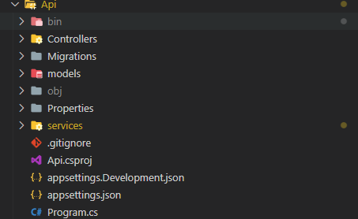

# TESTE BTG

Entregas realizadas:

- [x]  Deve ser uma aplicação totalmente nova;
- [x]  Apenas será permitido o uso de bibliotecas open source no desenvolvimento do projeto
- [x]  A solução deve estar em um repositório público do GitHub
- [x]  Utilizar uma tecnologia de banco de dados à sua escolha para armazenar as informações
coletadas
- [x]  Utilizar boas práticas de desenvolvimento e versionamento de código
- [ ]  Documentar a API com Swagger

Houve um problema na utilização da biblioteca do swagger, infelizmente acabei não conseguindo resolver o problema, então opitei por não utilizar.

## Estrutura

a estrutura ficou bem basica tendo apenas a Controller, Model e services (Mative a de migrations para facilitar em da de tentativa de replicar o Banco de Dados)



## Controller

A pasta controller ficou com as duas controller: GitController e languageController

LanguageController foi idealizada para salvar as linguagens para serem utilizadas na busca dos repositrios, podendo cadastrar quantas linguagens quiser para busca.

GitController foi idealizada para salvar os repositorios das linguagens cadastradas no sistema e exibir elas posteriormente.

```csharp
using System;
using System.Collections.Generic;
using System.IO;
using System.Linq;
using System.Net;
using System.Net.Http.Headers;
using Newtonsoft.Json;
using System.Text.Json;
using System.Net.Http;

using System.Threading.Tasks;
using Microsoft.AspNetCore.Http;
using Microsoft.AspNetCore.Mvc;
using Microsoft.EntityFrameworkCore;
using Api.Models;

using Api.Service;

namespace Api.Controllers
{
    [Route("api/Git")]
    [ApiController]
    public class GitController : ControllerBase
    {
        private readonly IGitService _service;

        public GitController(IGitService service)
        {
            _service = service;
        }

        //GitReposytory
        // GET: api/Git/getGitRepositoriesList
        [HttpGet("getGitRepositoriesList")]
        public async Task<ActionResult<IEnumerable<RepositoryPerLanguage>>> GetGitRepositoriesList()
        {
            try
            {
                return await _service.GetGitRepositoriesList();
            }
            catch (System.Exception)
            {
                return NotFound();
                throw;
            }
        }
    }
}
```

## Sevices

A etapa de serviços é onde se encontra a integração com o banco de dados onde o contexto é injetado e ela e injetada na controller.

A service é dividida em duas partes que é a interface para injeção de dependencia e a classe onde está estrutura dos metodos e onde se encontra as interações com o banco de dados.

exemplo da estrutura do Service:

```csharp
namespace Api.Service
{
    public interface IProgrammingLanguageService
    {
        Task<ActionResult<IEnumerable<ProgrammingLanguage>>> GetProgrammingLanguage();
    }

    public class ProgrammingLanguageService : IProgrammingLanguageService
    {
        private readonly MyContext _context;

        public ProgrammingLanguageService(MyContext context)
        {
            _context = context;
        }

        public async Task<ActionResult<IEnumerable<ProgrammingLanguage>>> GetProgrammingLanguage()
        {
            var languages = await _context.ProgrammingLanguages.ToListAsync();
            return languages;
        }
    }

}
```

## O Banco de dados

O banco de dados escolhido foi o mySQL por ser o primeiro sgbd que já utilizei e por já ter ele no meu computador pessoal
